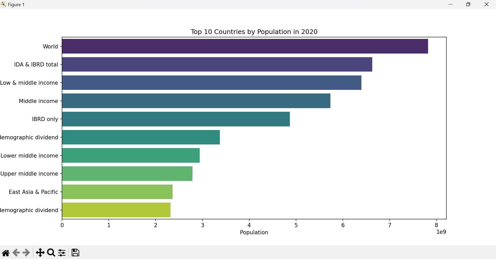

<h1>Data Visualization Project 📊</h1>

This project visualizes the distribution of a variable using a bar chart or histogram. The dataset used includes information about a population, such as ages or genders.

<h2>📁 Dataset</h2>

The dataset contains information about a population, including variables such as age and gender.

<h2>🚀 Installation</h2>
<ol>
    <li>Clone the repository:
        <pre><code>git clone https://github.com/your-username/data-visualization-project.git</code></pre>
    </li>
    <li>Navigate to the project directory:
        <pre><code>cd data-visualization-project</code></pre>
    </li>
    <li>Install the required dependencies:
        <pre><code>pip install -r requirements.txt</code></pre>
    </li>
</ol>

<h2>🛠️ Usage</h2>
<ol>
    <li>Place your dataset in the <code>data</code> folder.</li>
    <li>Update the <code>DATASET_PATH</code> in <code>visualize.py</code> with your dataset path.</li>
    <li>Run the visualization script:
        <pre><code>python visualize.py</code></pre>
    </li>
</ol>

<h2>📈 Output</h2>

The script generates a bar chart or histogram and saves it in the <code>output</code> folder.

<h2>🤝 Contributing</h2>

Contributions are welcome! Feel free to open an issue or submit a pull request with your ideas and improvements.

<h2>📜 License</h2>

This project is licensed under the MIT License.

